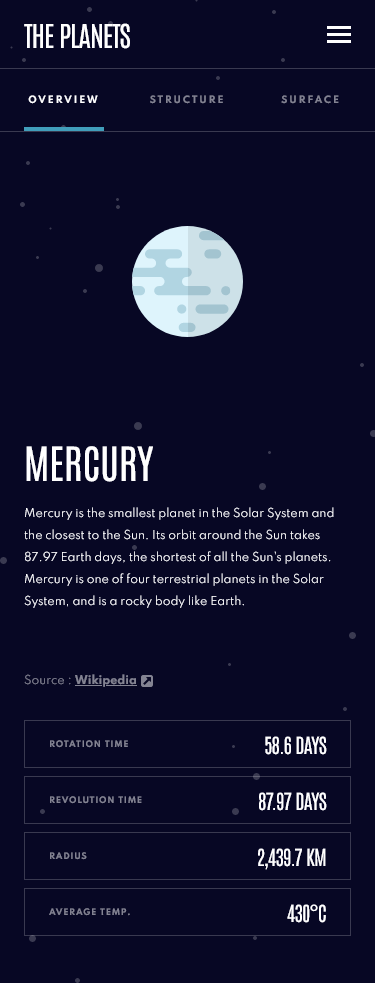
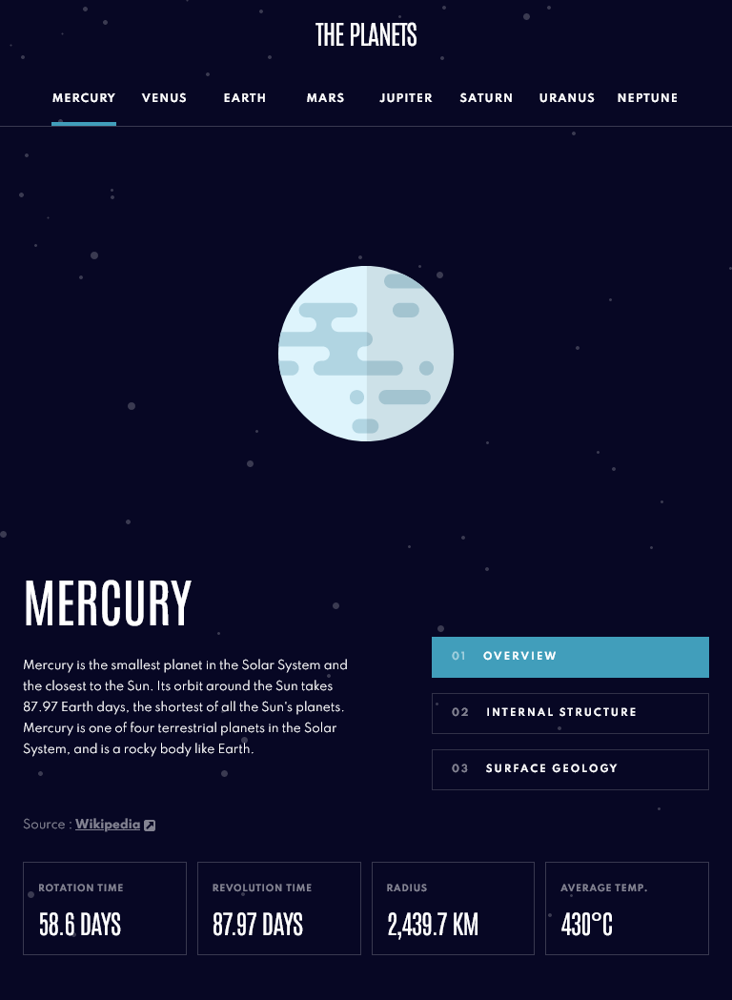
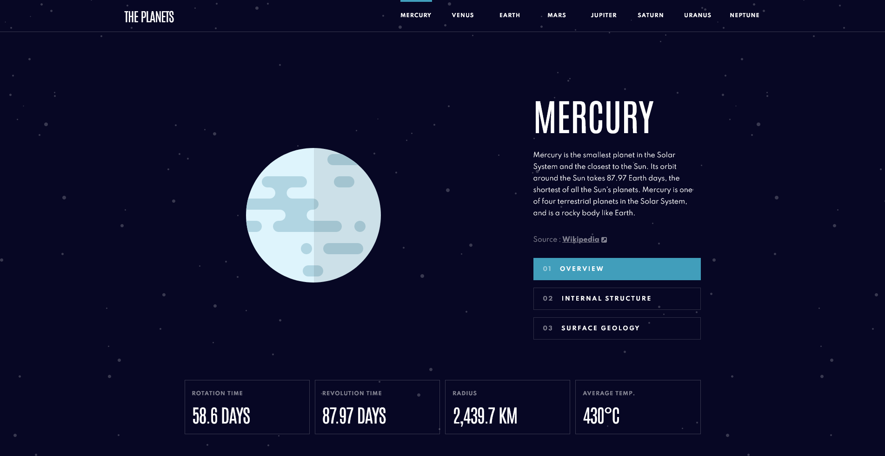

# Frontend Mentor - Planets fact site solution

This is a solution to the [Planets fact site challenge on Frontend Mentor](https://www.frontendmentor.io/challenges/planets-fact-site-gazqN8w_f). Frontend Mentor challenges help you improve your coding skills by building realistic projects.

## Table of contents

- [Overview](#overview)
  - [The challenge](#the-challenge)
  - [Screenshot](#screenshot)
  - [Links](#links)
- [My process](#my-process)
  - [Built with](#built-with)
  - [What I learned](#what-i-learned)
  - [Continued development](#continued-development)
  - [Useful resources](#useful-resources)
- [Author](#author)
- [Acknowledgments](#acknowledgments)

## Overview

### The challenge

Users should be able to:

- View the optimal layout for the app depending on their device's screen size
- See hover states for all interactive elements on the page
- View each planet page and toggle between "Overview", "Internal Structure", and "Surface Geology"

### Screenshot

### Links

- Solution URL: [Add solution URL here](https://github.com/PioKl/Planets-Facts)
- Live Site URL: [Add live site URL here](https://piokl.github.io/Planets-Facts/)

## My process

### Built with

- Semantic HTML5 markup
- SCSS
- CSS Flexbox
- CSS Grid
- Mobile-first workflow
- [React](https://reactjs.org/) - JS library
- [Typescript](https://www.typescriptlang.org/) - JS syntax

### What I learned

Very good project to work with json data, flex and grid. The project helped to practice React(hooks) and Typescript(types/interface)

### Continued development

More React with Typescript and more animations.

### Useful resources

- [Clamp Calculator](https://www.marcbacon.com/tools/clamp-calculator/) - To clamp fonts

## Author

- Website - [PioKl](https://github.com/PioKl)
- Frontend Mentor - [@PioKl](https://www.frontendmentor.io/profile/PioKl)

## Acknowledgments

Hamburger Menu(Coder Coder) - https://www.youtube.com/watch?v=pBv7igaxfQE
